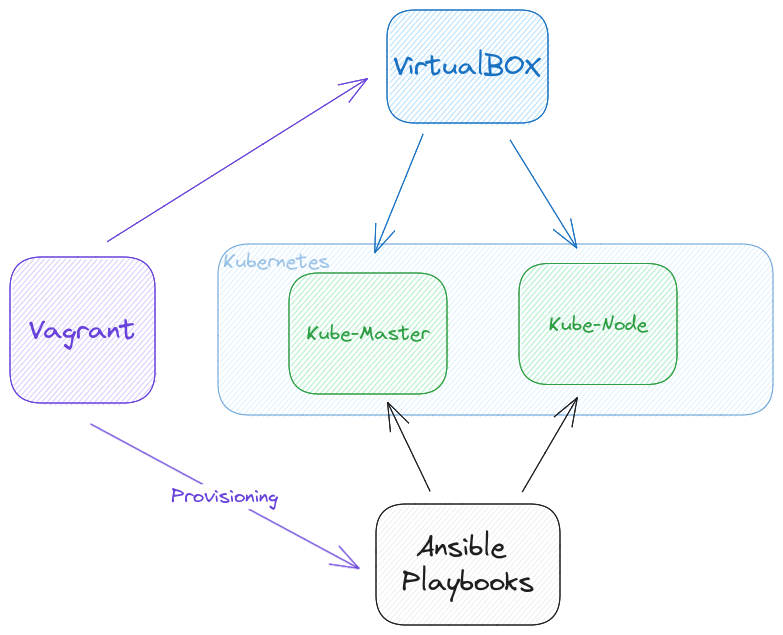

# Vagrantfile for Docker, Kubernetes, and Kafka Setup

<p align="center">
    
</p>

This Vagrantfile sets up a virtual machine with Docker, Kubernetes, and Kafka installed using Ansible. It uses VirtualBox as the virtualization provider.

```
This project uses semantic-release to automate the release process. Semantic-release analyzes commit messages to determine the appropriate version number and automatically generates changelogs and releases.
```

## Requirements
- VirtualBox installed on your machine
- Vagrant installed on your machine

## Installation
1. Clone this repository to your local machine.
2. Open a terminal and navigate to the cloned repository folder.
3. Run the command vagrant up to start the virtual machine. This command will also trigger the Ansible playbook to install Docker, Kubernetes, and Kafka.
4. Wait for the installation to complete.
5. Once the installation is complete, you can SSH into the virtual machine by running the command vagrant ssh.

## Usage
After you have SSH'd into the virtual machine, you can start using Docker, Kubernetes, and Kafka. You can create Docker containers, deploy Kubernetes applications, and use Kafka to stream data between applications.

## Cleanup
To stop and remove the virtual machine, run the command vagrant destroy. This will remove the virtual machine and all associated resources.

## Notes
- The Ansible playbook used in this Vagrantfile can be found in the playbooks directory.
- This Vagrantfile is intended for development and testing purposes only and should not be used in production environments.


## Useful commands


Install VirtualBox and Vagrant


Create a new Vagrantfile:
```sh
vagrant init hashicorp/bionic64
```

Start the VM:
```sh
vagrant up
```

Log in to it:
```sh
vagrant ssh
```

Initialize the Kubernetes cluster:
```sh
sudo kubeadm init --pod-network-cidr=192.168.0.0/16
```

copy the kubeconfig file:
```sh
mkdir -p $HOME/.kube
sudo cp -i /etc/kubernetes/admin.conf $HOME/.kube/config
sudo chown $(id -u):$(id -g) $HOME/.kube/config
```

Install the Calico network plugin:
```sh
kubectl apply -f https://docs.projectcalico.org/manifests/calico.yaml
```

Verify that the Kubernetes cluster is up:
```sh
kubectl get nodes
```

kafka cli:
```
kafka-topics --create --if-not-exists --topic input --bootstrap-server localhost:9092
kafka-topics --create --if-not-exists --topic output --bootstrap-server localhost:9092

kafka-topics --describe --topic input --bootstrap-server localhost:9092

kafka-topics --list --bootstrap-server localhost:9092

kafka-console-producer --bootstrap-server localhost:9092 --topic input --property "parse.key=true" --property "key.separator=:"
```
